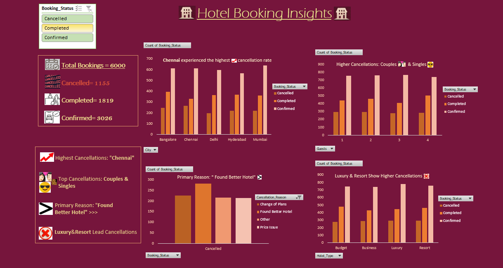

# excel-hotel-booking-dashboard
Hotel Booking Analysis Dashboard using Excel (Pivot Tables &amp; Charts)

# 🏨 Hotel Booking Dashboard (Excel)

## 📊 Project Overview
This Excel dashboard analyzes hotel booking data to identify trends in cancellations, customer behavior, and booking patterns.

## 🔍 Key Insights
- Chennai has the highest cancellation rate
- Couples & Singles show more cancellations
- Primary reason: "Found Better Hotel"
- Luxury & Resort hotels lead in cancellations

## 🛠️ Tools Used
- Microsoft Excel
- Pivot Tables
- Charts & Slicers

## 📈 Features
- Booking status filter (Cancelled, Completed, Confirmed)
- City-wise analysis
- Guest-type insights
- Cancellation reason breakdown
